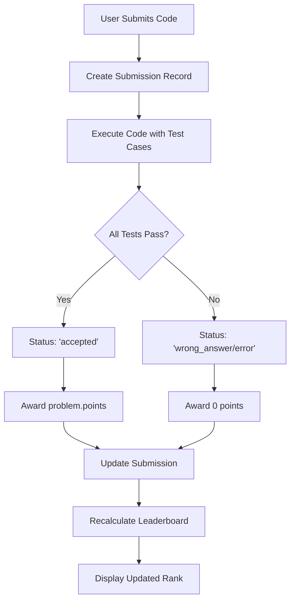

# Aura-7F Contest Platform - Point System 📊

## Overview
The Aura-7F Contest Platform uses a **time-based competitive scoring system** where participants earn points by solving problems correctly, and rankings are determined by:
1. **Total Points** (primary)
2. **Number of Problems Solved** (secondary)
3. **Speed of First Correct Solution** (tiebreaker)

---

## 🎯 How Points Are Awarded

### **Basic Rule: ALL Test Cases Must Pass**
```
✅ ALL test cases pass = Full points awarded
❌ ANY test case fails = 0 points awarded
```

### Point Award System
```typescript
earnedPoints = allTestCasesPassed ? problem.points : 0
```

**Key Principle:** Quality over quantity - partial solutions earn nothing!

---

## 📝 Point System Details

### **1. Problem Points Assignment**
Each problem in a contest has a predefined point value set by the admin:

```typescript
interface Problem {
  id: string;
  title: string;
  description: string;
  points: number;        // e.g., 100, 200, 500
  testCases: TestCase[];
}
```

**Example:**
- Easy Problem: 100 points
- Medium Problem: 200 points  
- Hard Problem: 500 points

### **2. Submission Evaluation**
When a participant submits code:

1. **Code Execution**: The system runs the code against ALL test cases
2. **Test Case Validation**: Each test case is checked for correct output
3. **Point Award Decision**:
   ```
   If passed_tests == total_tests:
       award problem.points
   Else:
       award 0 points
   ```

### **3. Submission Status**
```typescript
type SubmissionStatus = 
  | 'accepted'           // ✅ All tests passed - Points awarded
  | 'wrong_answer'       // ❌ Some tests failed - 0 points
  | 'compilation_error'  // ❌ Code didn't compile - 0 points
  | 'runtime_error'      // ❌ Code crashed - 0 points
  | 'running'            // ⏳ Still evaluating
```

**Only `'accepted'` status awards points!**

---

## 🏆 Leaderboard Ranking System

### **Ranking Algorithm (Priority Order)**
```
1. Total Points (Highest first) ⭐
2. Problems Solved (Most first) 🎯
3. Time to First Solve (Fastest first) ⚡
```

### **Leaderboard Calculation**
```sql
WITH best_submissions AS (
  -- Get first accepted submission for each problem
  SELECT DISTINCT ON (user_id, problem_id)
    user_id,
    problem_id,
    points,
    submitted_at
  FROM submissions
  WHERE contest_id = ${contestId} 
    AND status = 'accepted'
  ORDER BY user_id, problem_id, submitted_at ASC
)
SELECT 
  user_id,
  SUM(points) as total_points,
  COUNT(DISTINCT problem_id) as solved_problems,
  MIN(submitted_at) as first_submission_time
FROM best_submissions
GROUP BY user_id
ORDER BY 
  total_points DESC,           -- 1st: Highest points
  solved_problems DESC,         -- 2nd: Most problems solved
  first_submission_time ASC     -- 3rd: Fastest first solve
```

### **Why This Ranking System?**

#### **1️⃣ Total Points (Primary)**
- Rewards solving more/harder problems
- Higher difficulty = More points

#### **2️⃣ Problems Solved (Secondary)**
- Breaks ties between equal points
- Encourages breadth of solutions
- Solving 3x100pt problems > 2x150pt problems (if tied at 300pts)

#### **3️⃣ Time to First Solve (Tiebreaker)**
- Rewards speed and efficiency
- Based on **first accepted submission** for any problem
- Time is measured from contest start
- Encourages quick thinking and fast implementation

### **Best Submission Selection**
The system tracks the **first accepted submission** for each problem per user:

**Key Points:**
- ✅ Only **first accepted** submission counts per problem
- ✅ Multiple attempts allowed before acceptance
- ✅ No bonus for multiple acceptances
- ✅ Failed attempts don't affect scoring
- ✅ Time is based on first successful solve

---

## 💡 Examples

### **Example 1: Single Problem**
```
Problem: "Two Sum"
Points: 100
Test Cases: 5

Participant Submission:
- Test 1: ✅ Pass
- Test 2: ✅ Pass
- Test 3: ✅ Pass
- Test 4: ✅ Pass
- Test 5: ✅ Pass

Result: 5/5 passed → Earned 100 points
```

### **Example 2: Partial Pass (No Points)**
```
Problem: "Binary Search"
Points: 200
Test Cases: 10

Participant Submission:
- Tests 1-9: ✅ Pass
- Test 10: ❌ Fail (edge case)

Result: 9/10 passed → Earned 0 points ❌
```

### **Example 3: Contest with Multiple Problems**
```
Contest: "Weekly Challenge"
Start Time: 10:00:00 AM

Problems:
1. Easy Problem: 100 points (3 test cases)
2. Medium Problem: 200 points (5 test cases)
3. Hard Problem: 500 points (10 test cases)

Participant "Alice":
- 10:05:00 - Problem 1: ✅ All 3 tests passed → +100 points
- 10:15:00 - Problem 2: ✅ All 5 tests passed → +200 points
- 10:45:00 - Problem 3: ❌ 9/10 tests passed → +0 points

Alice's Stats:
- Total Points: 300
- Problems Solved: 2
- First Solve Time: 10:05:00 (5 minutes from start)
```

### **Example 4: Multiple Attempts**
```
Problem: "Array Sort"
Points: 150
Contest Start: 10:00:00

Participant "Bob":
- 10:08:00 - Attempt 1: ❌ Wrong Answer (3/5 passed) → 0 points
- 10:12:00 - Attempt 2: ❌ Runtime Error (0/5 passed) → 0 points
- 10:20:00 - Attempt 3: ✅ Accepted (5/5 passed) → +150 points ✨
- 10:25:00 - Attempt 4: ✅ Accepted (5/5 passed) → No additional points

Result: 
- Bob gets 150 points
- His solve time: 10:20:00 (20 minutes from start)
- Earlier failed attempts don't penalize him
```

### **Example 5: Leaderboard Ranking**
```
Contest Results:

Alice:
- Total Points: 300 (2 problems)
- First Solve: 10:05:00 (5 min)

Bob:
- Total Points: 300 (2 problems)
- First Solve: 10:08:00 (8 min)

Charlie:
- Total Points: 300 (3 problems × 100pts each)
- First Solve: 10:15:00 (15 min)

Dave:
- Total Points: 400 (2 problems)
- First Solve: 10:30:00 (30 min)

Final Leaderboard:
🥇 1st: Dave - 400 points (2 solved)
🥈 2nd: Charlie - 300 points (3 solved) ⭐ Most problems!
🥉 3rd: Alice - 300 points (2 solved, faster: 5 min)
    4th: Bob - 300 points (2 solved, slower: 8 min)

Explanation:
- Dave wins with most points (400 > 300)
- Charlie beats Alice/Bob: same 300pts but solved 3 problems vs 2
- Alice beats Bob: same points, same problems, but faster (5min < 8min)
```

---

## 🔒 Point System Rules

### **✅ What Counts**
- Only **accepted** submissions (all tests passed)
- Only **first accepted** submission per problem
- Submissions made **during active contest time**
- **Time to first solve** for tiebreaking

### **❌ What Doesn't Count**
- Partial passes (some tests failed)
- Compilation errors
- Runtime errors
- Multiple accepted submissions (no bonus)
- Submissions after contest ends
- Failed attempts before acceptance (don't penalize)

### **🎓 Fair Play Features**
1. **No Partial Credit**: Encourages complete solutions
2. **Time-Based Competition**: Rewards speed and accuracy
3. **Multi-Level Tiebreaking**: Points → Problems → Speed
4. **Problem Variety Bonus**: Solving more problems beats fewer
5. **No Penalty for Attempts**: Try as many times as needed
6. **Speed Matters**: Among equals, fastest solver wins

---

## 📊 Database Schema

### **Submissions Table**
```sql
CREATE TABLE submissions (
  id UUID PRIMARY KEY,
  contest_id UUID,
  problem_id UUID,
  user_id UUID,
  code TEXT,
  language VARCHAR(50),
  status VARCHAR(50),      -- 'accepted', 'wrong_answer', etc.
  passed_test_cases INT,   -- Number of tests passed
  total_test_cases INT,    -- Total tests for this problem
  points INT,              -- Points awarded (0 or problem.points)
  submitted_at TIMESTAMP
);
```

### **Leaderboard View**
```typescript
interface LeaderboardEntry {
  userId: string;
  email: string;
  fullName: string;
  totalPoints: number;        // Sum of points from all accepted problems
  solvedProblems: number;     // Count of unique problems solved
  lastSubmissionTime: string; // Tiebreaker timestamp
  submissions: {
    problemId: string;
    points: number;
    time: string;
  }[];
}
```

---

## 🚀 Implementation Flow



---

## 💻 Code References

### **Point Award Logic** (`src/app/api/submissions/route.ts`)
```typescript
// Award points ONLY if ALL test cases pass
const allPassed = result.passed === result.total;
const earnedPoints = allPassed ? problem.points : 0;

await submissionStorage.update(created.id, {
  status: allPassed ? 'accepted' : 'wrong_answer',
  passedTestCases: result.passed,
  points: earnedPoints
});
```

### **Leaderboard Calculation** (`src/lib/storage.ts`)
```typescript
// Time-based competitive ranking system
WITH best_submissions AS (
  -- Get first accepted submission for each problem per user
  SELECT DISTINCT ON (user_id, problem_id)
    user_id,
    problem_id,
    points,
    submitted_at
  FROM submissions
  WHERE contest_id = ${contestId} 
    AND status = 'accepted'
  ORDER BY user_id, problem_id, submitted_at ASC
)
SELECT 
  user_id,
  SUM(points) as total_points,
  COUNT(DISTINCT problem_id) as solved_problems,
  MIN(submitted_at) as first_submission_time
FROM best_submissions
GROUP BY user_id
ORDER BY 
  total_points DESC,           -- Primary: Highest points
  solved_problems DESC,         -- Secondary: Most problems
  first_submission_time ASC     -- Tiebreaker: Fastest
```

---

## 📈 Current Features ✅

**Implemented:**
- ✅ All-or-nothing scoring
- ✅ Time-based ranking (fastest wins ties)
- ✅ Multi-level tiebreaking
- ✅ Problem variety bonus
- ✅ No penalty for failed attempts
- ✅ First accepted submission tracking

## 🔮 Future Enhancements (Potential)

Possible improvements to consider:
- ⭐ Time penalty for wrong submissions
- ⭐ Bonus points for fast solves
- ⭐ Difficulty multipliers
- ⭐ Memory/execution efficiency scoring
- ⭐ Streak bonuses

---

## 🎯 Summary

**The Aura-7F point system is designed to:**
1. ✅ Reward complete, correct solutions
2. ✅ Encourage solving multiple problems
3. ✅ Value speed and efficiency
4. ✅ Provide fair, multi-tiered competition
5. ✅ Rank by: Points → Problems → Speed
6. ✅ Allow unlimited attempts without penalty

### **Winning Strategy** 🏆
1. **Solve more problems** - Each acceptance counts
2. **Solve harder problems** - More points per problem
3. **Solve quickly** - Speed breaks ties
4. **Test thoroughly** - Only full passes count
5. **Don't fear mistakes** - Failed attempts don't hurt you

**Remember:** *All test cases must pass to earn points, but the fastest complete solver wins the tie!* ⚡
